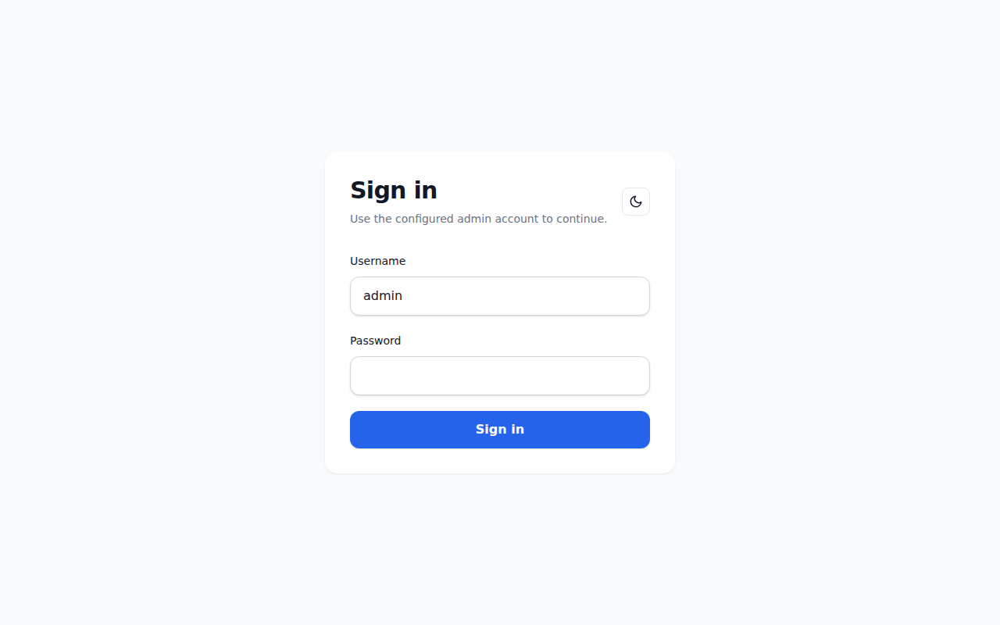
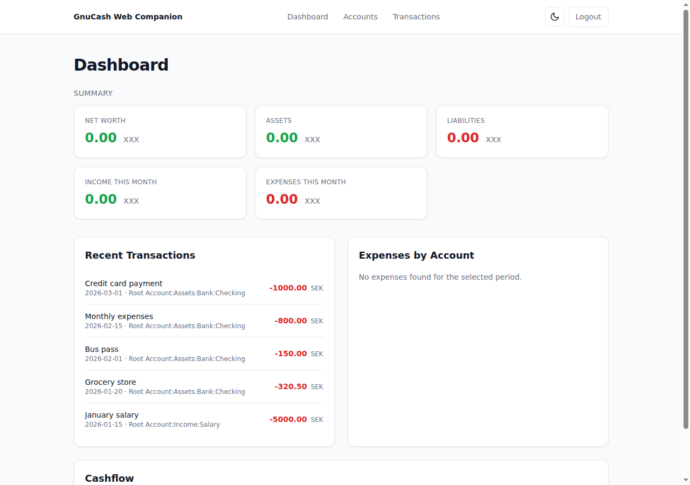
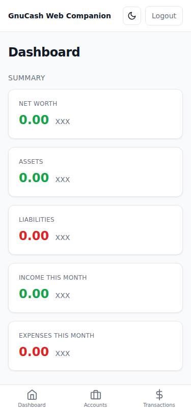
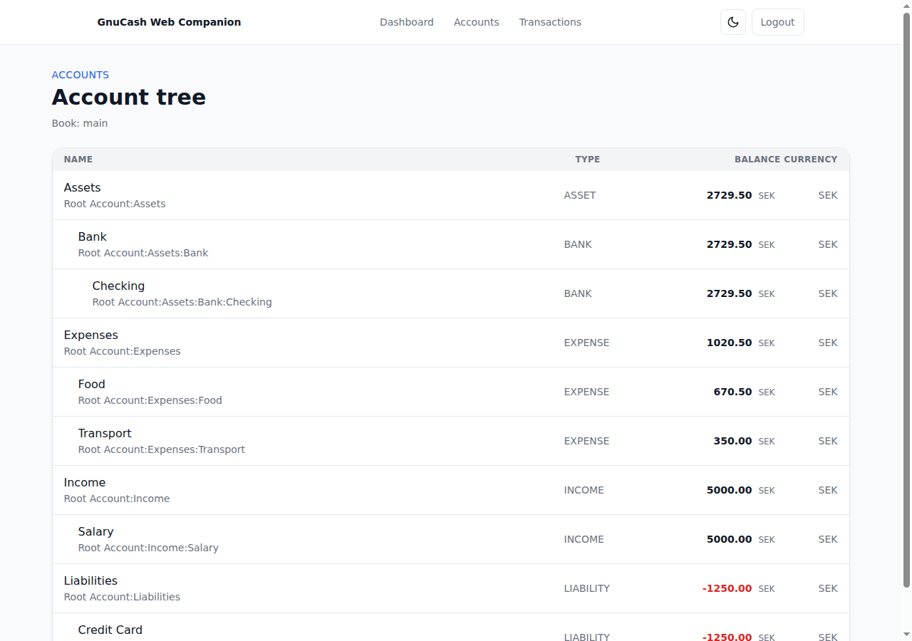
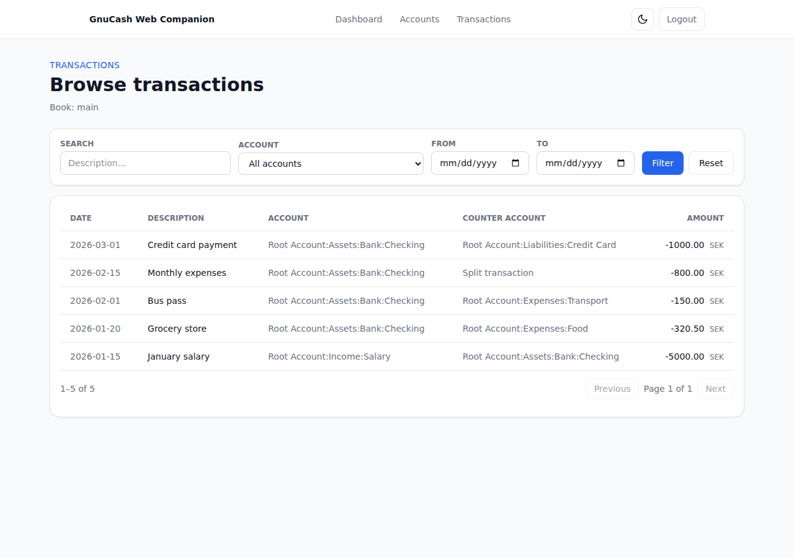
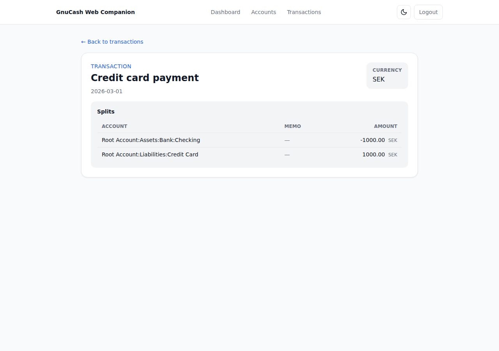
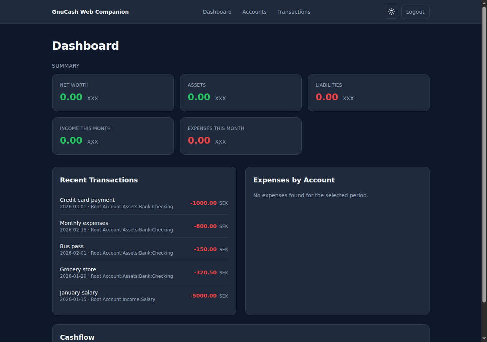

# gnucash-web-companion

> **Status: pre-alpha / MVP in progress** — this repository is suitable for review and experimentation, but it is not feature-complete, audited, or production-ready.

A modern, self-hosted web companion for existing [GnuCash](https://www.gnucash.org/) books. It is designed to browse accounts, transactions, dashboards, and basic reports in a browser while keeping GnuCash Desktop as the authoritative editor.

Short pitch: **read-only browser/mobile visibility for existing GnuCash SQL books, without turning the web app into the authoritative accounting editor.**

## What it is

- A **read-only-first** web application for existing GnuCash SQL books, accessed through [piecash](https://github.com/sdementen/piecash).
- A **self-hosted** app you run on your own infrastructure.
- A **companion**, not a replacement: GnuCash Desktop remains the source of truth for editing.
- **Single-book by default**, with a read-only book switcher foundation for later multiple independent books with scoped access.

## What it is not

- It is **not** a GnuCash replacement.
- It is **not** a hosted personal-finance SaaS.
- It is **not** true collaborative multi-user accounting.
- It does **not** write to your GnuCash book by default.
- It does **not** provide any production-readiness or security guarantee yet.

## Who this is for / not for

This project may fit you if:

- you already use GnuCash and want browser/mobile read-only access on self-hosted infrastructure;
- you want dashboards, account/transaction browsing, search/filtering, and CSV export over an existing SQL book;
- you are comfortable testing pre-alpha software against a disposable copy first;
- you want GnuCash Desktop to remain the authoritative editor.

This project is not a fit if you need:

- production-ready or security-audited accounting software;
- hosted personal-finance SaaS;
- collaborative multi-user editing of one book;
- banking integrations, CSV/OFX import, or full GnuCash replacement features;
- safe write-mode access to your only copy of a GnuCash book.

## Current status

- Phase 0–171 are complete.
- MVP v0.1 remains **read-only by default**.
- Controlled-write code, if present in the repository, is experimental post-MVP work and disabled by default.
- First public pre-alpha release: `v0.0.1-prealpha`.
- Current public read-only pre-alpha release after the Phase 171 authorized gate: [`v0.1.7-readonly`](https://github.com/valentusys/gnucash-web-companion/releases/tag/v0.1.7-readonly).
- Latest published read-only release notes: [docs/release/v0.1.7-readonly-notes.md](docs/release/v0.1.7-readonly-notes.md) ([checklist](docs/release/v0.1.7-readonly-checklist.md), [final gate](docs/release/v0.1.7-readonly-final-gate.md), [publication evidence](docs/release/v0.1.7-readonly-publication-evidence.md)).
- Previous public read-only release: [`v0.1.6-readonly`](https://github.com/valentusys/gnucash-web-companion/releases/tag/v0.1.6-readonly) ([notes](docs/release/v0.1.6-readonly-notes.md), [checklist](docs/release/v0.1.6-readonly-checklist.md), [final gate](docs/release/v0.1.6-readonly-final-gate.md), [publication evidence](docs/release/v0.1.6-readonly-publication-evidence.md)).
- `v0.2.0-writealpha` is published as a pre-alpha write-alpha GitHub pre-release after explicit authorization: [notes](docs/release/v0.2.0-writealpha-notes.md), [checklist](docs/release/v0.2.0-writealpha-checklist.md), [final gate](docs/release/v0.2.0-writealpha-final-gate.md).
- Compatibility matrix: [docs/gnucash-compatibility.md](docs/gnucash-compatibility.md). Current compatibility evidence is synthetic/disposable fixture evidence only; no real GnuCash Desktop version support is claimed yet.
- Recent post-release maintenance:
  - Phase 133 improved read-only empty/error states.
  - Phase 134 added shape-matched read-only loading skeletons.
  - Phase 135 polished mobile navigation and small-screen transaction detail layout.
  - Phase 136 refreshed compatibility documentation while keeping synthetic/disposable evidence boundaries explicit.
  - Phase 137 refreshed local/LAN/VPN deployment hardening docs, JWT-secret guidance, CORS examples, app metadata DB backup expectations, and pre-deployment checks.
  - Phase 138 synchronized public README/CHANGELOG/roadmap/status documentation.
  - Phase 139 reran synthetic/disposable Docker/Caddy read-only dogfood with `GNUCASH_WRITES_ENABLED=false`.
  - Phase 140 audited `v0.1.4-readonly` readiness and found a documentation-drift blocker.
  - Phase 141 prepared conservative unpublished `v0.1.4-readonly` release artifacts and status updates.
  - Phase 142 passed the final publication gate and published `v0.1.4-readonly` as an authorized GitHub pre-release.
  - Phase 143 made active-book/read-only status visible in the app shell.
  - Phase 144 added a local read-only account-tree filter for large account trees.
  - Phase 145 added a transaction current-view summary that explains page range, newest-first order, filter parity, and the 10,000-row CSV export cap.
  - Phase 146 polished transaction detail/split readability with responsive metadata cards/table, split memo/reconciliation visibility, and a safe empty split state.
  - Phase 147 made dashboard/reporting totals more explicit about `reporting_basis=base_currency_only`, no currency conversion, excluded mixed currencies, and unknown `XXX`/zero-total limitations.
  - Phase 148 improved `/books` self-hosting readiness with app-metadata-only operator guidance, current/default/read-only/access/storage/status clarity, explicit unsupported MVP management actions, and no private path rendering in the UI.
  - Phase 149 expanded Russian localization coverage for the new read-only UX from Phases 143–148 through the existing catalog and static route checks.
  - Phase 150 reran synthetic/disposable Docker/Caddy read-only API and headless browser dogfood with `GNUCASH_WRITES_ENABLED=false` after the latest UX/localization work.
  - Phase 151 prepared unpublished `v0.1.5-readonly` maintenance release notes, checklist, and final gate; the candidate was ready for a later authorized publish phase after local checks and CI passed, but no tag/release was created in that phase.
  - Phase 152 re-ran the final release gate and published `v0.1.5-readonly` as an authorized GitHub pre-release after clean `main`, `HEAD == origin/main`, green local checks, green GitHub CI for the release commit, tag/release absence, write-disabled Compose defaults, and sensitive tracked-file hygiene were confirmed.
  - Phase 153 added a reproducible fresh-clone Docker smoke helper and documented a synthetic/disposable clean-checkout pass with dummy local-only secrets and `GNUCASH_WRITES_ENABLED=false`.
  - Phase 154 refreshed GnuCash Desktop compatibility blocker evidence for GitHub #22 without broad Desktop/version/backend claims.
  - Phase 155 improved multi-book read-only operator diagnostics with safe storage/access metadata, private-path redaction, and no upload/delete/default-changing/registry-edit actions.
  - Phase 156 added dashboard drilldown links to existing read-only transaction filters while preserving base-currency-only/no-conversion limitations.
  - Phase 157 improved scheduled/recurring transaction read-only clarity with URL-only filters, deterministic safe sorting, stronger no-template-split-leak copy, and backend/frontend regression coverage.
  - Phase 158 fixed and pinned a narrow-width mobile account/transaction dogfood issue, including 320x720 no-overflow and CSV export touch-target assertions.
  - Phase 159 expanded release-critical English/Russian frontend catalog coverage without claiming full localization.
  - Phase 160 reran full synthetic/disposable Docker/Caddy API and browser release-candidate dogfood with `GNUCASH_WRITES_ENABLED=false`.
  - Phase 161 re-ran the final release gate and published `v0.1.6-readonly` as an authorized GitHub pre-release after clean `main`, `HEAD == origin/main`, green local checks, green GitHub CI for the release commit, tag/release absence, write-disabled Compose defaults, and sensitive tracked-file hygiene were confirmed.
  - Phase 162 synchronized the stale roadmap baseline and verified the published `v0.1.6-readonly` tag from a fresh Docker checkout with synthetic/disposable data, `GNUCASH_WRITES_ENABLED=false`, API smoke, browser dogfood, disabled validate/create/patch/delete probes, and no raw screenshot/export/backup artifacts.
  - Phase 163 probed disposable Debian 12 GnuCash Desktop/CLI tooling and recorded a safe compatibility-fixture blocker instead of broad Desktop/version/backend claims.
  - Phase 164 hardened selected-book cookie recovery and read-only book-context access edge cases without exposing private paths or adding management/write actions.
  - Phase 165 added synthetic large account-tree benchmark evidence and capped deep-hierarchy indentation to reduce overflow risk without production scalability claims.
  - Phase 166 hardened read-only CSV export feedback and account-scoped parity for empty, filtered, capped/truncated, string-amount, and no-conversion states.
  - Phase 167 improved local/LAN auth/session behavior with unsafe-Origin rejection and JWT-expiry-aligned web cookies without claiming a production security audit.
  - Phase 168 improved first-run and broken-configuration operator guidance through safe health/startup/login/books/error/troubleshooting messages.
  - Phase 169 completed a release-critical Russian localization slice for visible read-only/operator paths without claiming full localization.
  - Phase 170 reran full cycle 2 synthetic/disposable Docker/Caddy API and browser release-candidate dogfood with `GNUCASH_WRITES_ENABLED=false`.
  - Phase 171 re-ran the final release gate and published `v0.1.7-readonly` as an authorized GitHub pre-release after clean `main`, `HEAD == origin/main`, green local checks, green GitHub CI for the release commit, tag/release absence, write-disabled Compose defaults, and sensitive tracked-file hygiene were confirmed.
- Russian localization/i18n foundation started in Phase 52; English documentation remains canonical. See [README.ru.md](README.ru.md) and [docs/localization.md](docs/localization.md).
- Community announcement drafts and where-to-share guidance were refreshed in Phase 53 for cautious feedback collection, not production marketing.
- Startup diagnostics, a richer non-sensitive health endpoint, and troubleshooting guidance were added in Phase 54 for self-hosted deployments.
- Phase 55 completed a v0.1 read-only scope-freeze audit: ready to prepare a `v0.1.0-readonly` plan, not ready to publish v0.1 yet.
- Phase 56 created the `v0.1.0-readonly` release plan and checklist. This is planning only; no v0.1 tag/release has been published.
- Phase 57 completed the `v0.1.0-readonly` release-gate audit. v0.1 publication is blocked until conservative release notes and a copied/disposable-data runtime smoke/dogfood pass are completed.
- Phase 58 audited the expected publication state and confirmed that no `v0.1.0-readonly` tag/GitHub release exists yet; publication remains blocked by the Phase 57 release-gate issues.
- Phase 59 completed a post-release regression-risk audit and found that a true post-v0.1 regression audit is not applicable yet because no `v0.1.0-readonly` tag/GitHub release exists; publication remains blocked by the same release-gate issues.
- Phase 60 completed a dogfood-readiness audit and found the maintainer can safely start read-only dogfood on a copied real book; this is not a completed dogfood pass and does not unblock v0.1 publication until runtime evidence is recorded.
- Phase 61 completed a dogfood-results audit and found it is blocked because no actual copied-book dogfood results are recorded yet; v0.1 publication remains blocked by missing dogfood/runtime evidence (#25) and conservative release notes (#24).
- Phase 62 completed a deployment-safety audit and found no deployment-doc blocker for local/LAN/VPN-only read-only testing; direct public-internet exposure remains unsafe, v0.1 publication remains blocked by #24/#25, and CORS origin narrowing for shared LAN/VPN deployments is tracked in #26.
- Phase 63 completed a backup/recovery audit and found no backup/recovery release blocker after correcting stale Compose write-disabled verification examples; backup/recovery remains manual/operator-run with no production disaster-recovery guarantee, and v0.1 publication remains blocked by #24/#25.
- Phase 64 completed a compatibility-claims audit and found no broad-compatibility blocker: tested coverage remains limited to documented synthetic GnuCash SQL SQLite fixture paths, PostgreSQL/MySQL/MariaDB/XML/all-version support is not claimed, #22 remains open for real-version fixture coverage, and v0.1 publication remains blocked by #24/#25.
- Phase 65 completed a test-coverage audit and found the automated suite supports the current pre-alpha/read-only maturity claims, but does not replace the #25 copied/disposable-data runtime smoke/dogfood gate; v0.1 publication remains blocked by #24/#25.
- Phase 66 completed a security-posture audit without claiming professional security audit status: auth cookie/JWT/read-only defaults remain conservative, #27 tracks redacting full GnuCash book paths from seed logs, #26 continues to track CORS origin narrowing visibility, and v0.1 publication remains blocked by #24/#25.
- Phase 67 completed an open-source hygiene audit: license/contributing/code-of-conduct/security/funding/templates/topics/issues are present and useful, the missing `needs-triage` label was created, the GitHub repository description now includes read-only positioning, and v0.1 publication remains blocked by #24/#25.
- Phase 68 completed a documentation-formatting audit: markdown source readability is acceptable with non-blocking cleanup needed, small historical fence/link clarifications were fixed, #28 tracks broader gradual raw-markdown readability cleanup, and v0.1 publication remains blocked by #24/#25.
- Phase 69 completed a localization/i18n audit: English remains canonical, Russian README/UI scope is conservative and opt-in, #29 tracks a non-blocking accounting/safety terminology glossary, and v0.1 publication remains blocked by #24/#25.
- Phase 70 completed a community-announcement audit: the project is ready only for limited feedback-oriented sharing in narrow technical/GnuCash circles, not broad launch-style promotion; v0.1 publication remains blocked by #24/#25.
- Phase 71 completed a performance-risk audit: no new blocker was found for the current pre-alpha/read-only posture, but large-book, many-splits, CSV timeout/truncation, and dashboard aggregate performance evidence is not available yet and is tracked in #30–#33; do not claim known large-book scalability.
- Phase 72 completed a data model and money-correctness audit: backend core money paths use Decimal/string DTOs and CSV export preserves decimal strings; canonical sign/split guidance is now in [docs/money-model.md](docs/money-model.md), and frontend display-only `Number()` money usage is tracked in #34; v0.1 publication remains blocked by #24/#25.
- Phase 73 completed a multi-book access model audit: user-book access remains explicit through `UserBookAccess`, unauthorized book-aware routes are blocked, the switcher shows only accessible independent read-only books, archive/visibility semantics were clarified in [docs/book-switcher-readonly-model.md](docs/book-switcher-readonly-model.md), and #35 tracks archived-book/full route-family boundary-test hardening; v0.1 publication remains blocked by #24/#25.
- Phase 74 completed a controlled-writes boundary audit: writes remain disabled by default, backend validate/create/patch routes are feature-gated before write service construction, write UI remains hidden unless explicitly enabled and requires warning/acknowledgement, disposable-fixture write tests plus lock/backup-restore coverage exist, and #36 tracks remaining v0.2 write-readiness gates; write mode remains experimental/post-MVP and v0.1 publication remains blocked by #24/#25.
- Phase 75 completed a v0.1.1 maintenance-release audit and found no maintenance release is needed/applicable because `v0.1.0-readonly` has not been published; v0.1 publication remains blocked by #24/#25, and v0.1.1 should not be considered until after a real v0.1.0 release plus post-release maintenance change set exist.
- Phase 76 completed a v0.2 planning audit and found the project is not ready to create/promote a controlled-writes planning milestone: `v0.1.0-readonly` remains unpublished and blocked by #24/#25, copied-book dogfood evidence is still missing, #36 remains open for v0.2 write-readiness gates, and controlled writes must stay experimental/post-MVP and disabled by default.
- Phase 77 completed a real Docker read-only dogfood attempt on a copied/disposable GnuCash SQL book: API login, health, accounts, account detail, transactions, transaction detail, search/filter, CSV export, and disabled write-endpoint probes passed with `GNUCASH_WRITES_ENABLED=false`, but browser/UI dogfood was blocked by #37 because `/login` redirected to itself.
- Phase 78 fixed #37 and reran Docker/Caddy browser dogfood on copied/disposable data: `/login`, dashboard, accounts, account detail, transactions, transaction detail, CSV export, hidden write UI, API smoke, and disabled write probes passed with `GNUCASH_WRITES_ENABLED=false`.
- Phase 79 accepted the Phase 78 dogfood evidence for #25, created conservative `v0.1.0-readonly` release notes, ran the final release gate, and found `v0.1.0-readonly` ready for publication as a separate explicit next step. No v0.1 tag or GitHub release has been published yet.
- Phase 80 published `v0.1.0-readonly` as an annotated git tag and GitHub pre-release on the Phase 79 gate commit, using `docs/release/v0.1.0-readonly-notes.md` as the release notes. This was a narrow publish-only phase: no scope expansion, writes remain disabled by default, and no v0.2 work was started.
- Phase 81 completed post-release hardening for #27: default-book seed logs now expose only a sanitized book filename/label instead of full filesystem paths or connection URI details; regression tests cover path and URI redaction. No new tag/release was published, writes remain disabled by default, and no v0.2 work was started.
- Phase 82 completed post-release read-only boundary hardening for #35: backend regression tests now cover archived-book hiding/blocking and unauthorized access denial across the book-aware accounts, transactions, CSV export, and reports route families. No new tag/release was published, writes remain disabled by default, and no v0.2 work was started.
- Phase 83 completed post-release frontend money-display hardening for #34: dashboard/recent-transaction/cashflow/expense-bar/amount-filter UI decisions now use decimal-string helpers instead of `Number()` on money strings. No new tag/release was published, writes remain disabled by default, and no v0.2 work was started.
- Phase 84 completed post-release CSV export truncation/timeout hardening for #32: successful CSV export responses now advertise the row cap, matching total, truncation flag, and synchronous timeout policy; the frontend export proxy forwards them; tests cover truncated and non-truncated exports with disposable fake data; and the transactions UI/docs tell users/operators that large exports are synchronous and should be narrowed if they time out. No new tag/release was published, writes remain disabled by default, and no v0.2 work was started.
- Phase 85 attempted the post-v0.1 copied personal-book dogfood pass. No safe copied personal GnuCash SQL book was available to this environment outside git, so no real-book pass is claimed; a redacted blocker/result artifact was recorded in [docs/dogfood/phase-85-personal-copied-book-results.md](docs/dogfood/phase-85-personal-copied-book-results.md), GitHub #38 tracks the rerun when a safe copied book is available, no private data was committed, and writes remain disabled by default.
- Phase 86 triaged the Phase 85 dogfood findings and found no concrete app bug to fix; the only blocker is #38, the missing safe copied personal book. A tested redacted preflight helper and CLI were added so future dogfood attempts can classify a copied-book candidate without leaking private paths or committing book data. No real-book pass is claimed, no new tag/release was published, writes remain disabled by default, and no v0.2 work was started.
- Phase 87 added a synthetic large-book read-only benchmark for accounts, transactions, dashboard summary, and CSV export using generated data only; GitHub #30 was closed and #39 tracks a CSV export row-count/header mismatch.
- Phase 88 extended the benchmark to include a 60-split transaction, account-detail pagination, and transaction-detail rendering for many splits; GitHub #31 was closed with evidence.
- Phase 89 hardened dashboard aggregate correctness and benchmark coverage: summary responses now expose base-currency-only/no-conversion limitations, the dashboard UI displays them, report date errors are clearer, and the synthetic benchmark covers summary, cashflow-by-month, expenses-by-account, and recent-transactions. GitHub #33 was closed with evidence; #39 remains open.
- Phase 90 improved transaction search/filter usability for #11: the web filter panel now shows a readable active filter summary for search, account, date range, and amount range, with copy clarifying that the same active filters apply to the list and CSV export. CSV export filter query parity remains unchanged, and no backend write changes were made.
- Phase 91 added a read-only `/books` metadata page for the safe subset of #13: users can see accessible configured books, the current/default marker, base currency, storage type, read-only status, and access status, while archived/unauthorized books remain hidden/blocked by the API and no upload, deletion, registry editing, GnuCash data editing, collaborative, or family-wallet workflow is exposed.
- Phase 92 moved compatibility fixture/version-matrix evidence forward with a safe metadata collector for copied/disposable GnuCash SQLite books and narrow docs updates, without broad compatibility claims or private data.
- Phase 93 extended the limited Russian localization slice: desktop/mobile navigation now localizes the `/books` label, the read-only `/books` metadata page uses English/Russian catalog strings for headings/status/safety copy, and `README.ru.md`/`docs/localization.md` document that English remains canonical and translation is incomplete.
- Phase 94 made the post-v0.1 maintenance-release decision: more fixes are required before preparing `v0.1.1-readonly`, primarily because #39 remains an open CSV export row-count/header consistency blocker. No `v0.1.1-readonly` tag/release was published.

## MVP scope: read-only first

The first public milestone is intentionally conservative:

- Connect to one configured GnuCash SQL book.
- Open the book in read-only mode.
- Show account hierarchy and balances.
- Browse account detail and transaction detail.
- Search/filter transactions with pagination and documented CSV export parity (see [docs/transactions-filters.md](docs/transactions-filters.md)).
- Use a stabilized read-only book switcher for already-accessible independent books (see [docs/book-switcher-readonly-model.md](docs/book-switcher-readonly-model.md)).
- Show basic dashboard reports: net worth, income/expense, cash flow, top expense categories.
- Store application metadata in a separate app database, not inside the GnuCash book.
- Provide Docker/self-host deployment scaffolding.

Explicitly out of scope for the MVP:

- Transaction/account creation or editing enabled by default.
- Direct GnuCash schema modification.
- Invoice, bill, customer, or vendor editing.
- True collaborative multi-user editing.
- Family shared-wallet baseline.
- Multi-book management UI as a core baseline.
- Hosted SaaS operation.
- Fake currency conversion.

## Safety warning

GnuCash books contain sensitive accounting data. This project is read-only-first, but early software can still have bugs and operational risks.

Use it safely:

- **Use a test copy of your book first.** Do not point pre-alpha builds at your only copy.
- Maintain regular, tested backups of all GnuCash files.
- Do not commit `.gnucash`, `.sqlite`, backups, `.env`, or secrets to the repository.
- Do not expose early builds directly to the public internet.
- Review [docs/GNUCASH_SAFETY.md](docs/GNUCASH_SAFETY.md) before testing with real data.

## Experimental write code

This repository may contain experimental post-MVP controlled-write code. It is disabled by default with:

```text
GNUCASH_WRITES_ENABLED=false
```

Controlled writes are not part of MVP v0.1. They are experimental write-alpha code, disabled by default, and additionally constrained by the backend test-environment gate when explicitly enabled. The current write-alpha CRUD surface includes create, patch metadata, and authorized DELETE transaction routes only for synthetic/disposable test scope. Do not enable write mode against your only copy of a GnuCash book, and do not treat it as production-safe. Test only with synthetic/disposable or otherwise copied books that you can restore or delete. See [docs/v0.2-controlled-writes.md](docs/v0.2-controlled-writes.md) for the design and safety requirements, [docs/write-alpha-maintainer-checklist.md](docs/write-alpha-maintainer-checklist.md) for the maintainer review gate, and [docs/write-alpha-recovery-procedure.md](docs/write-alpha-recovery-procedure.md) for recovery steps.

## Quick start

> This is a pre-alpha quick start. It assumes Docker Engine and Docker Compose are installed. Docker runtime has not been certified for production use.

```bash
git clone https://github.com/valentusys/gnucash-web-companion.git
cd gnucash-web-companion
cp .env.example .env
# Edit .env: set a real JWT_SECRET, admin bootstrap password/hash, and GNUCASH_DEFAULT_BOOK_PATH.
# The placeholder JWT_SECRET in .env.example is intentionally rejected by the API.
# Keep GNUCASH_WRITES_ENABLED=false for the read-only MVP.
# Put only a test copy of your GnuCash SQL book under data/books/.
docker compose up --build
```

Default local URLs:

- Web UI: <http://localhost:8080>
- API health via proxy: <http://localhost:8080/api/health>

See [docs/DEVELOPMENT.md](docs/DEVELOPMENT.md) for local development setup and
[docs/deployment/local-secure-deployment.md](docs/deployment/local-secure-deployment.md)
for conservative local/LAN/VPN deployment guidance. See
[docs/operations/backup-and-recovery.md](docs/operations/backup-and-recovery.md)
for manual backup and recovery guidance, and
[docs/operations/troubleshooting.md](docs/operations/troubleshooting.md)
for safe health/startup diagnostics.

## Architecture

- **Frontend:** SvelteKit in `apps/web/`
- **Backend:** FastAPI in `apps/api/`
- **GnuCash access:** piecash opened read-only behind a service layer
- **App metadata DB:** separate SQLite database (`app.db`) for users, book registry, access metadata, and audit logs
- **Deployment:** Docker Compose with Caddy reverse proxy

See [docs/ARCHITECTURE.md](docs/ARCHITECTURE.md) for details.

## Release readiness

The current public read-only pre-alpha tag/release is:

```text
v0.1.7-readonly
```

Current published release checklist, notes, and evidence:

- [docs/release/v0.1.7-readonly-checklist.md](docs/release/v0.1.7-readonly-checklist.md)
- [docs/release/v0.1.7-readonly-notes.md](docs/release/v0.1.7-readonly-notes.md)
- [docs/release/v0.1.7-readonly-final-gate.md](docs/release/v0.1.7-readonly-final-gate.md)
- [docs/release/v0.1.7-readonly-publication-evidence.md](docs/release/v0.1.7-readonly-publication-evidence.md)

GitHub release:

- <https://github.com/valentusys/gnucash-web-companion/releases/tag/v0.1.7-readonly>

`v0.1.7-readonly` was published as a GitHub pre-release after an authorized Phase 171 publication gate. No packages or binary artifacts were published.

Previous read-only release `v0.1.6-readonly` remains available at <https://github.com/valentusys/gnucash-web-companion/releases/tag/v0.1.6-readonly>.

Previous published read-only maintenance release artifacts:

- [docs/release/v0.1.6-readonly-checklist.md](docs/release/v0.1.6-readonly-checklist.md)
- [docs/release/v0.1.6-readonly-notes.md](docs/release/v0.1.6-readonly-notes.md)
- [docs/release/v0.1.6-readonly-final-gate.md](docs/release/v0.1.6-readonly-final-gate.md)
- [docs/release/v0.1.6-readonly-publication-evidence.md](docs/release/v0.1.6-readonly-publication-evidence.md)

`v0.1.6-readonly` remains available as the previous GitHub pre-release after an authorized Phase 161 publication gate.

Published write-alpha pre-release artifacts:

- [docs/release/v0.2.0-writealpha-checklist.md](docs/release/v0.2.0-writealpha-checklist.md)
- [docs/release/v0.2.0-writealpha-notes.md](docs/release/v0.2.0-writealpha-notes.md)
- [docs/release/v0.2.0-writealpha-final-gate.md](docs/release/v0.2.0-writealpha-final-gate.md)

`v0.2.0-writealpha` is published as a GitHub pre-release after explicit Val authorization. The release remains pre-alpha/experimental; write mode remains disabled by default and real/private-book write safety is not claimed.

Previous public read-only pre-alpha tag/releases:

- [`v0.1.5-readonly`](https://github.com/valentusys/gnucash-web-companion/releases/tag/v0.1.5-readonly)
  - [checklist](docs/release/v0.1.5-readonly-checklist.md)
  - [notes](docs/release/v0.1.5-readonly-notes.md)
  - [final gate](docs/release/v0.1.5-readonly-final-gate.md)
  - [publication evidence](docs/release/v0.1.5-readonly-publication-evidence.md)
- [`v0.1.4-readonly`](https://github.com/valentusys/gnucash-web-companion/releases/tag/v0.1.4-readonly)
  - [checklist](docs/release/v0.1.4-readonly-checklist.md)
  - [notes](docs/release/v0.1.4-readonly-notes.md)
  - [final gate](docs/release/v0.1.4-readonly-final-gate.md)
  - [publication evidence](docs/release/v0.1.4-readonly-publication-evidence.md)
- [`v0.1.3-readonly`](https://github.com/valentusys/gnucash-web-companion/releases/tag/v0.1.3-readonly)
  - [checklist](docs/release/v0.1.3-readonly-checklist.md)
  - [notes](docs/release/v0.1.3-readonly-notes.md)
  - [final gate](docs/release/v0.1.3-readonly-final-gate.md)
- [`v0.1.2-readonly`](https://github.com/valentusys/gnucash-web-companion/releases/tag/v0.1.2-readonly)
  - [checklist](docs/release/v0.1.2-readonly-checklist.md)
  - [notes](docs/release/v0.1.2-readonly-notes.md)
  - [final gate](docs/release/v0.1.2-readonly-final-gate.md)
- [`v0.1.1-readonly`](https://github.com/valentusys/gnucash-web-companion/releases/tag/v0.1.1-readonly)
  - [checklist](docs/release/v0.1.1-readonly-checklist.md)
  - [notes](docs/release/v0.1.1-readonly-notes.md)
  - [final gate](docs/release/v0.1.1-readonly-final-gate.md)
- [`v0.1.0-readonly`](https://github.com/valentusys/gnucash-web-companion/releases/tag/v0.1.0-readonly)
  - [checklist](docs/release/v0.1.0-readonly-checklist.md)
  - [notes](docs/release/v0.1.0-readonly-notes.md)
  - [final gate](docs/release/v0.1.0-readonly-final-gate.md)

The previous public pre-alpha tag/release is:

```text
v0.0.2-prealpha
```

Previous release checklist and notes:

- [docs/release/v0.0.2-prealpha-checklist.md](docs/release/v0.0.2-prealpha-checklist.md)
- [docs/release/v0.0.2-prealpha-notes.md](docs/release/v0.0.2-prealpha-notes.md)

Previous GitHub release:

- <https://github.com/valentusys/gnucash-web-companion/releases/tag/v0.0.2-prealpha>

The previous public pre-alpha tag/release is:

```text
v0.0.1-prealpha
```

Previous release checklist and notes:

- [docs/release/v0.0.1-prealpha-checklist.md](docs/release/v0.0.1-prealpha-checklist.md)
- [docs/release/v0.0.1-prealpha-notes.md](docs/release/v0.0.1-prealpha-notes.md)

Do not publish further git tags, GitHub releases, npm packages, or PyPI packages unless explicitly requested.

## Repository description and topics

Suggested GitHub repository description:

> Modern self-hosted read-only web companion for GnuCash books, built with SvelteKit, FastAPI, and piecash.

Suggested topics:

- `gnucash`
- `personal-finance`
- `accounting`
- `self-hosted`
- `sveltekit`
- `fastapi`
- `open-source`
- `finance`
- `sqlite`

## Comparison with related projects

- [`gnucash-web`](https://github.com/joshuabach/gnucash-web): a simple Flask/Bootstrap mobile-friendly companion that supports adding/editing transactions. This project borrows the companion idea but keeps the MVP read-only by default and uses FastAPI/SvelteKit.
- [`GnuDash`](https://github.com/QuirkyTurtle94/GnuDash): a rich Next.js/browser-WASM dashboard/editor with import/export-oriented workflows. This project instead keeps GnuCash access server-side behind a backend service layer and avoids making the web UI a replacement editor.
- [Fava / Beancount](https://beancount.github.io/fava/): a strong web UI for Beancount plain-text ledgers. This project targets existing GnuCash SQL books rather than migrating users to Beancount.

More detail: [docs/COMPETITIVE_REVIEW.md](docs/COMPETITIVE_REVIEW.md).

## Screenshots

All screenshots use synthetic fixture data — no real financial data.

### Login



### Dashboard — Desktop



### Dashboard — Mobile



### Accounts Tree



### Transactions List



### Transaction Detail



### Dark Mode



## Contributing

Contributions are welcome, especially documentation, tests, safety review, and read-only UX improvements. Please read [CONTRIBUTING.md](CONTRIBUTING.md) before opening a PR.

Community/draft materials:

- [docs/community/announcement-draft.md](docs/community/announcement-draft.md)
- [docs/community/where-to-share.md](docs/community/where-to-share.md)
- [docs/community/social-preview.md](docs/community/social-preview.md)

Compatibility/safety docs:

- [docs/gnucash-compatibility.md](docs/gnucash-compatibility.md)
- [docs/gnucash-version-fixture-plan.md](docs/gnucash-version-fixture-plan.md)
- [docs/gnucash-compatibility-fixture-v1.md](docs/gnucash-compatibility-fixture-v1.md)
- [docs/money-model.md](docs/money-model.md)
- [docs/localization.md](docs/localization.md)

## Funding

This project is not yet funded. See [.github/FUNDING.yml](.github/FUNDING.yml) for current funding metadata/placeholders.

## License

This project is licensed under the **GNU Affero General Public License v3.0 (AGPL-3.0)** — see [LICENSE](LICENSE).

### Why AGPL-3.0?

`gnucash-web-companion` is a self-hosted web application. AGPL-3.0 keeps modifications shared over a network open, aligns well with GnuCash's GPL-3.0 license family, and preserves the project as free/open software.

This licensing summary is not legal advice.

## Security and Deployment

This is a **pre-alpha** self-hosted application. Auth tokens are stored in
`httpOnly` cookies with `sameSite=lax` and protocol-dependent `secure` flags.
The JWT logout model is stateless (frontend deletes the cookie; no server-side
blacklist). **Do not expose this application directly to the public internet.**
Always use HTTPS in production and keep `GNUCASH_WRITES_ENABLED=false` unless
you explicitly need post-MVP write features.

See [docs/security/auth-cookie-deployment.md](docs/security/auth-cookie-deployment.md)
for full details on cookie attributes, deployment warnings, and limitations. See
[docs/deployment/local-secure-deployment.md](docs/deployment/local-secure-deployment.md)
for practical local-only and LAN/VPN-only deployment hardening guidance.
